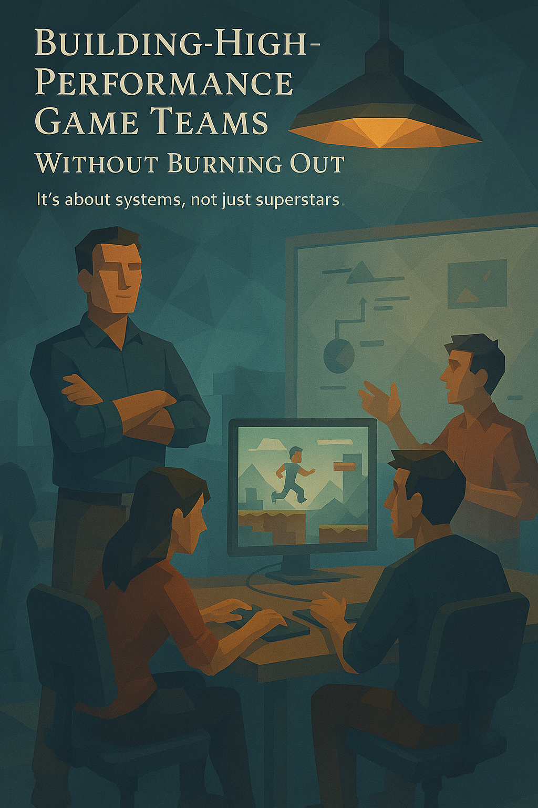

# You Don't Need Rockstars

Forget chasing "rockstar" developers. It's a waste of time. What you need are systems that make everyone better.

I've seen it firsthand: team success comes from how well people work together, not individual genius. Good systems turn average teams into winners.

## Make Your Systems Work

What makes teams great? Not talent alone, but the right environment:

**1. Team beats individual**

The team creates value, not lone wolves. Games succeed or fail as a group effort.

Make sure everyone knows the main goal and their part in it. Don't let teams compete with each other. Value people who help others as much as star performers.

**2. Keep it simple**

When people don't understand how to succeed, they fail. Create clear processes anyone can follow.

Welcome questions when things seem muddy. Make sure everyone knows their job and what to do when problems pop up. Create basic guides for tasks you do often.

**3. Pick your battles**

Game dev gets chaotic fast. Clear priorities keep teams on track.

Tell everyone what matters most, right now. Plan for risks before they blow up. Help team leads sort out what's important in their areas.

**4. Spread the leadership**

Big teams need to break into smaller groups with clear leaders.

Trust these leaders to handle their areas. Help them grasp priorities and let them make calls. Move leaders where they can help most. Make sure all leaders share key info with their teams.

## Lead Up and Down

As a producer, you lead whether it's in your title or not. And you need to lead in both directions.

**Leading down** means getting off your butt and talking to the people doing the work. See their problems firsthand. Watch teams in action to catch issues early. Talk face to face to build trust.

**Leading up** means helping bosses make decisions on time. If they drag their feet, find ways to give them better info or clearer options. Always tell leadership what's happening and why.

Both matter. Take charge of influencing everyone around you, no matter who reports to whom.

## More Making, Less Meeting

Think about how much time your team spends talking about work versus doing work. When talk outweighs action, fix it.

First, get everyone on the same page about goals. When people agree on the target, they need fewer check ins.

Second, make short term tasks crystal clear. This stops people from spinning their wheels trying to figure out what to do.

Third, while the team works on today's jobs, set up tomorrow's. Gather the info and tools they'll need to start strong.

Teams waste time hunting for files, figuring out who to talk to, or searching through code. Handle this prep work before it's needed, and work flows better.

Always try to remove speed bumps from the creative process. Each obstacle you clear lets your team focus more on making a great game.

## Know When to Lead, When to Manage

In free to play games, where player interest over time is everything, you need both vision setting and execution skills.

Good producers know when to inspire and when to organize. They create clear paths forward while clearing roadblocks.

Remember, your main job isn't tracking tasks. It's helping your team create the best player experience possible. Everything else just supports that goal.

#### [Home](./README.md) 
