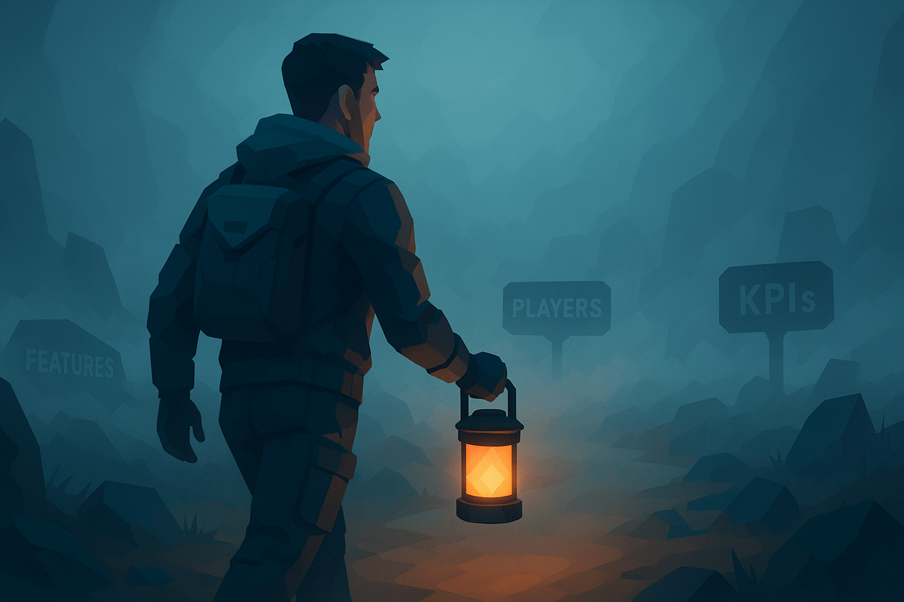

Making free-to-play games comes with one guarantee: you won't know everything. The best developers don't fight this fact, they work with it.

F2P games face questions from every direction. Will players dig this feature? Will this monetization work? How will player habits shift over time? These questions never end.

Great developers know uncertainty shrinks naturally as you go. Your job isn't to pretend you know everything up front. It's to make solid calls with what you know now.

## Getting Comfortable with Not Knowing

Here are three ways to handle uncertainty better:

**1. Step back to see progress**

When stuck in details, you miss how far you've come. Take time to compare where you are now versus months ago. This shows patterns and progress hidden in daily work.

**2. Most choices can be fixed later**

Few decisions in game dev stick forever. If something flops, you can change course. This works early in dev and even with live games. This knowledge speeds up decision making. You don't need perfection on the first try.

**3. Test to build confidence**

Regular tests with your target players cut through doubt. They tell you if you're heading right or need to shift. Each test shrinks uncertainty a bit more.

When you feel lost, try flipping the question: describe what your game isn't and what features it won't have. This often reveals hidden assumptions that point you forward.

## Killing Ambiguity

Ambiguity is worse than uncertainty. It happens when goals and boundaries aren't clear. In F2P, I've seen it cause:

* Teams burning hours without real progress
* Feature creep blowing up schedules and budgets
* Teams stressed from unclear vision
* Fighting between team members
* Leaders who can't decide anything

As a producer, fight ambiguity by:

**When teams spin their wheels:** Push for clearer vision. Ask if people know the direction. Set time limits on brainstorming.

**When feature lists explode:** Compare value versus cost for each feature. Rank them by impact. Check if new ideas match your game's core strengths.

**When teams get anxious:** Talk straight, share key info, build trust in the plan. Face risks head on so people feel ready.

**When conflict breaks out:** Set clear ownership lines, create safe spaces to speak up, and follow through on what you promise.

**When no one decides anything:** Find what's causing the freeze. Use data where you can, tackle the risks causing doubt, remind everyone most calls can be changed later.

## Smart Risk Management

Good producers spot problems before they hit. Two tools I swear by:

**Value Stream Mapping:** Chart your whole process from idea to release. This shows bottlenecks before you crash into them.

**Swimlanes:** These show connections between different teams and highlight handoff points. They make clear who needs what from whom and when.

These work best together and need no fancy software. Start with paper sketches. The goal isn't perfection but seeing what's coming.

## The Bottom Line

Uncertainty in F2P isn't a problem to fix. It's part of the job. Learning to work with it beats fighting it.

The skill isn't removing uncertainty but getting good at working within it. Make solid calls with limited info and keep adapting as you learn.

Remember, things get clearer as you move forward. Each decision, test, and update brings more clarity. The teams that win keep moving, learn fast, and don't freeze when facing the unknown.

#### [Home](./README.md) 
